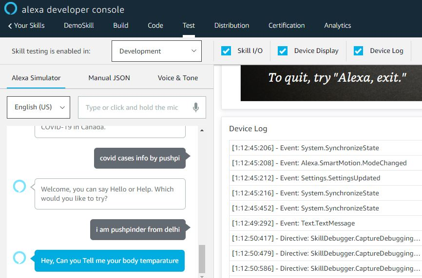
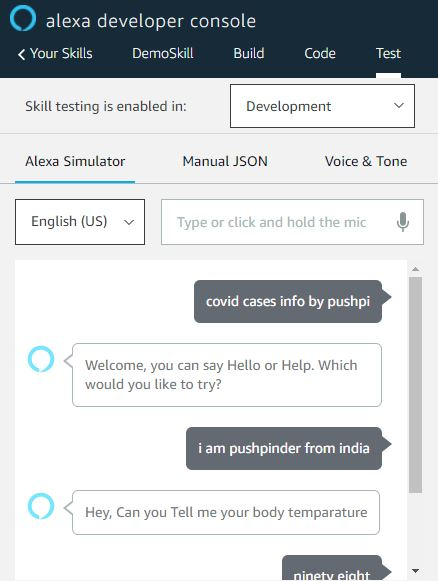
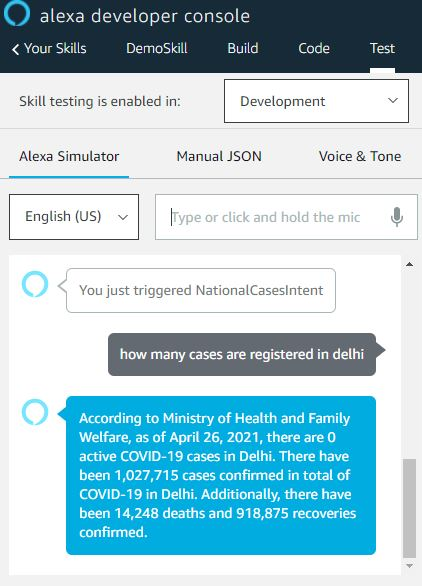

  <h1>Alexa Covid Cases Info By Pushpi</h1>
  
 
    
  

# Technologies
- **Node.js**: Backend to create the skills
- **AWS Lambda**: Backend to host the skills

# Data Provider
- https://covid19.who.int/table

1. **Ask about a state**: "how many cases have been reported in India?"
2. **Ask about a country**: "how many cases have been reported in India?"
3. **Ask about top countries**: "which countries have most coronavirus cases?"
4. **Ask about top states in India**: "which states have most coronavirus cases?"

## How to use the features
You can either invoke the skill about saying "covid cases info by pushpi" or just directly ask Alexa a question by saying things like "how many cases have been reported in India?"

Ask about a state|She will ask you about your body temperature|If you have asked something different you can ask
:-------------------------:|:-------------------------:|:-------------------------:
||

Ask about a country   |Ask about global summary   |  Ask About a State
:-------------------------:|:-------------------------:|:-------------------------:
||
